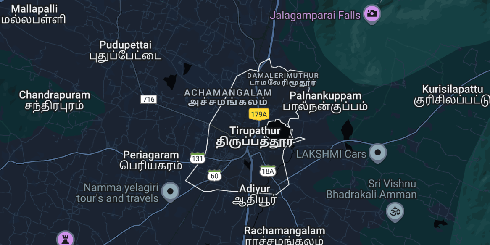
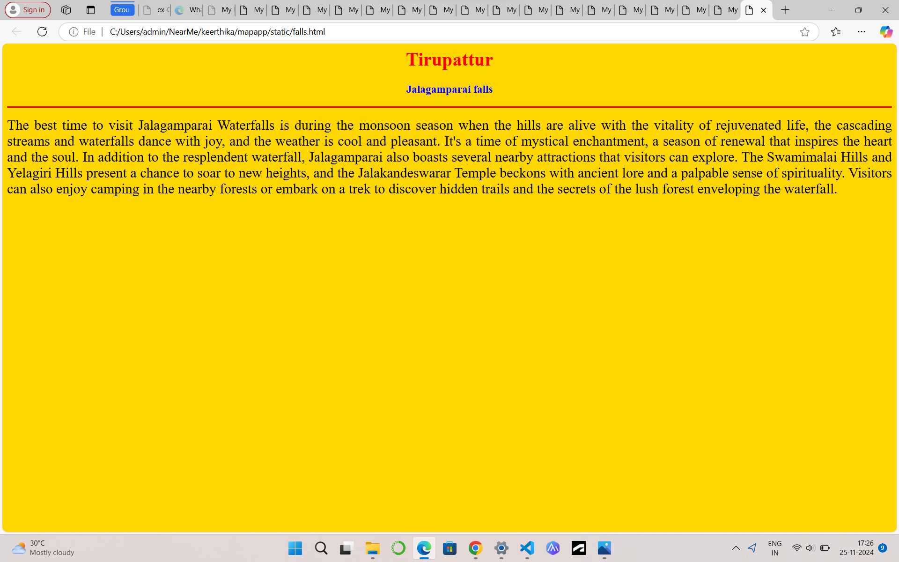
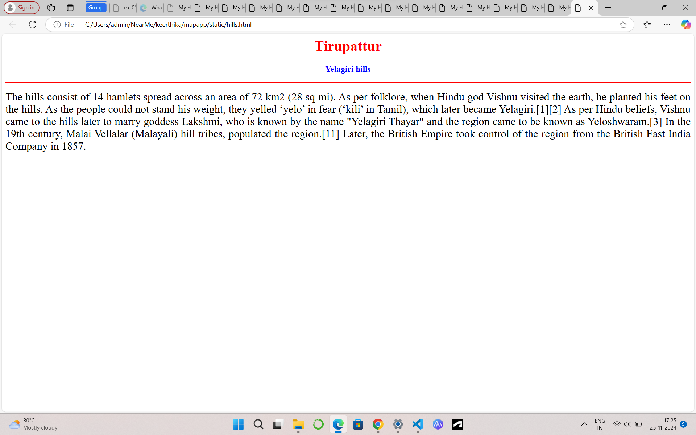
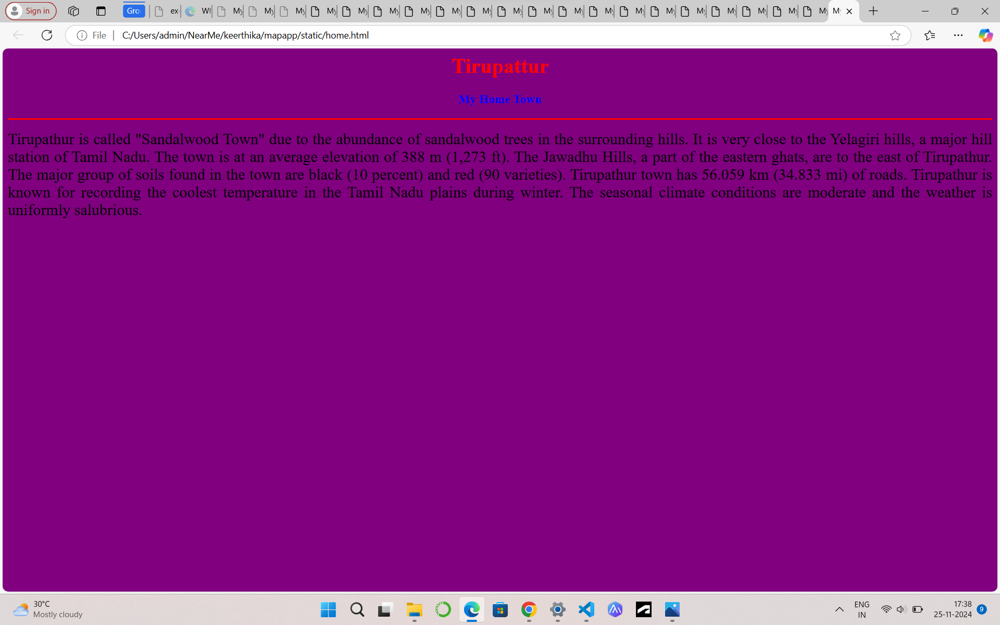
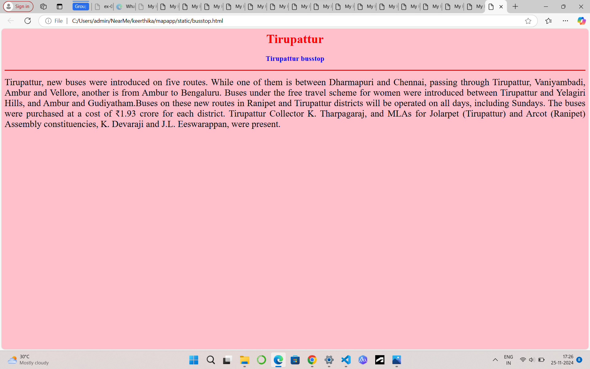
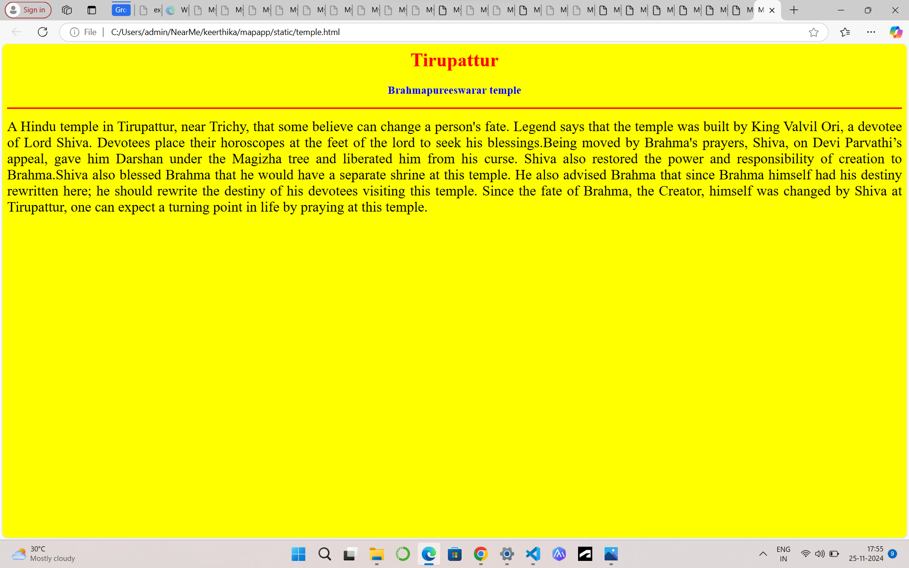

# Ex04 Places Around Me
## Date: 25.11.2024

## AIM
To develop a website to display details about the places around my house.

## DESIGN STEPS

### STEP 1
Create a Django admin interface.

### STEP 2
Download your city map from Google.

### STEP 3
Using ```<map>``` tag name the map.

### STEP 4
Create clickable regions in the image using ```<area>``` tag.

### STEP 5
Write HTML programs for all the regions identified.

### STEP 6
Execute the programs and publish them.

## CODE
```
map.html

<html>
    <head>
        <title>My City</title>
    </head>
    <body>
        <h1 align="center">
        <font color="red"><b>Tirupattur</b></font>
        </h1>
        <h3 align="center">
            <font color="blue"><b>keerthika A (24900898)</b></font>
        </h3>
        <center>
            
            <map name="MyCity">
            <area shape="rect" coords="700,300,900,900"href="home.html"title="My Home Town">
            <area shape="circle" coords="570,230,45"href="temple.html"title="Brahmapureeswarar temple">
            <area shape="circle" coords="700,200,40"href="hills.html"title="Yelagiri hills">
            <area shape="circle" coords="1120,360,25"href="falls.html"title="Jalagamparai falls">
            <area shape="rect" coords="700,300,900,900"href="busstop.html"title="Tirupattur busstop">
            </map>
        </center>

    </body>
</html>

falls.html

<html>
    <head>
        <title>My Home Town</title>
    </head>
    <body bgcolor="gold">
    <h1 align="center">
        <font color="red"><b>Tirupattur</b></font>
    </h1>
    <h3 align="center">
        <font color="blue"><b>Jalagamparai falls</b></font>
    </h3>
    <hr size="3" color="red">
    <p align="justify">
        <font face="Tirupattur"size="5">
            The best time to visit Jalagamparai Waterfalls is during the monsoon season when the hills are alive with the vitality of rejuvenated life, 
            the cascading streams and waterfalls dance with joy, and the weather is cool and pleasant. It's a time of mystical enchantment, 
            a season of renewal that inspires the heart and the soul.
            In addition to the resplendent waterfall, Jalagamparai also boasts several nearby attractions that visitors can explore.
            The Swamimalai Hills and Yelagiri Hills present a chance to soar to new heights, and the Jalakandeswarar Temple beckons with ancient lore and a palpable sense of spirituality.
             Visitors can also enjoy camping in the nearby forests or embark on a trek to discover hidden trails and the secrets of the lush forest enveloping the waterfall.

        </font>
    </p>
</body>
</html>

hills.html

<html>
    <head>
        <title>My Home Town</title>
    </head>
    <body bgcolor="white">
    <h1 align="center">
        <font color="red"><b>Tirupattur</b></font>
    </h1>
    <h3 align="center">
        <font color="blue"><b>Yelagiri hills</b></font>
    </h3>
    <hr size="3" color="red">
    <p align="justify">
        <font face="Tirupattur"size="5">
            The hills consist of 14 hamlets spread across an area of 72 km2 (28 sq mi).
             As per folklore, when Hindu god Vishnu visited the earth, he planted his feet on the hills.
             As the people could not stand his weight, they yelled ‘yelo’ in fear (‘kili’ in Tamil),
             which later became Yelagiri.[1][2] As per Hindu beliefs, Vishnu came to the hills later to marry goddess Lakshmi,
             who is known by the name "Yelagiri Thayar" and the region came to be known as Yeloshwaram.[3]
             In the 19th century, Malai Vellalar (Malayali) hill tribes, populated the region.[11] Later, 
             the British Empire took control of the region from the British East India Company in 1857.

        </font>
    </p>
</body>
</html>

home.html

<html>
    <head>
        <title>My Home Town</title>
    </head>
    <body bgcolor="purple">
    <h1 align="center">
        <font color="red"><b>Tirupattur</b></font>
    </h1>
    <h3 align="center">
        <font color="blue"><b></b>My Home Town</font>
    </h3>
    <hr size="3" color="red">
    <p align="justify">
        <font face="Tirupattur"size="5">
             Tirupathur is called "Sandalwood Town" due to the abundance of sandalwood trees in the surrounding hills.
             It is very close to the Yelagiri hills, a major hill station of Tamil Nadu.
             The town is at an average elevation of 388 m (1,273 ft). The Jawadhu Hills, a part of the eastern ghats, are to the east of Tirupathur. 
             The major group of soils found in the town are black (10 percent) and red (90 varieties). Tirupathur town has 56.059 km (34.833 mi) of roads.
             Tirupathur is known for recording the coolest temperature in the Tamil Nadu plains during winter.
             The seasonal climate conditions are moderate and the weather is uniformly salubrious.

        </font>
    </p>
</body>
</html>

busstop.html

<html>
    <head>
        <title>My Home Town</title>
    </head>
    <body bgcolor="pink">
    <h1 align="center">
        <font color="red"><b>Tirupattur</b></font>
    </h1>
    <h3 align="center">
        <font color="blue"><b>Tirupattur busstop</b></font>
    </h3>
    <hr size="3" color="red">
    <p align="justify">
        <font face="Tirupattur"size="5">
             Tirupattur, new buses were introduced on five routes.
             While one of them is between Dharmapuri and Chennai, passing through Tirupattur, Vaniyambadi, Ambur and Vellore,
             another is from Ambur to Bengaluru. Buses under the free travel scheme for women were introduced between Tirupattur and 
             Yelagiri Hills, and Ambur and Gudiyatham.Buses on these new routes in Ranipet and Tirupattur districts will be operated on all days, including Sundays. 
             The buses were purchased at a cost of ₹1.93 crore for each district. Tirupattur Collector K.
             Tharpagaraj, and MLAs for Jolarpet (Tirupattur) and Arcot (Ranipet) Assembly constituencies, K. Devaraji and J.L. Eeswarappan, were present.

        </font>
    </p>
</body>
</html>

temple.html

<html>
    <head>
        <title>My Home Town</title>
    </head>
    <body bgcolor="yellow">
    <h1 align="center">
        <font color="red"><b>Tirupattur</b></font>
    </h1>
    <h3 align="center">
        <font color="blue"><b>Brahmapureeswarar temple</b></font>
    </h3>
    <hr size="3" color="red">
    <p align="justify">
        <font face="Tirupattur"size="5">
            A Hindu temple in Tirupattur, near Trichy, that some believe can change a person's fate. 
            Legend says that the temple was built by King Valvil Ori, a devotee of Lord Shiva. 
            Devotees place their horoscopes at the feet of the lord to seek his blessings.Being moved by Brahma's prayers, Shiva, on Devi Parvathi’s appeal,
            gave him Darshan under the Magizha tree and liberated him from his curse. 
            Shiva also restored the power and responsibility of creation to Brahma.Shiva also blessed Brahma that he would have a separate shrine at this temple. 
            He also advised Brahma that since Brahma himself had his destiny rewritten here; he should rewrite the destiny of his devotees visiting this temple.
            Since the fate of Brahma, the Creator, himself was changed by Shiva at Tirupattur, one can expect a turning point in life by praying at this temple.
            
            

        </font>
    </p>
</body>
</html>

```
## OUTPUT







## RESULT
The program for implementing image maps using HTML is executed successfully.
