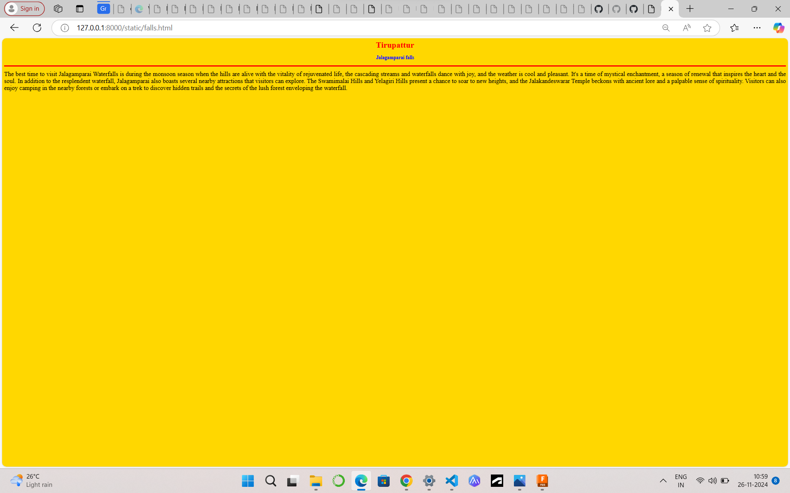
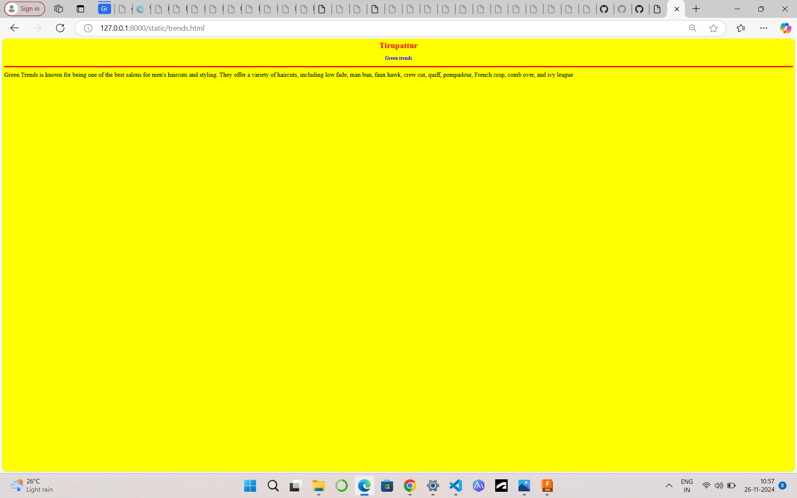
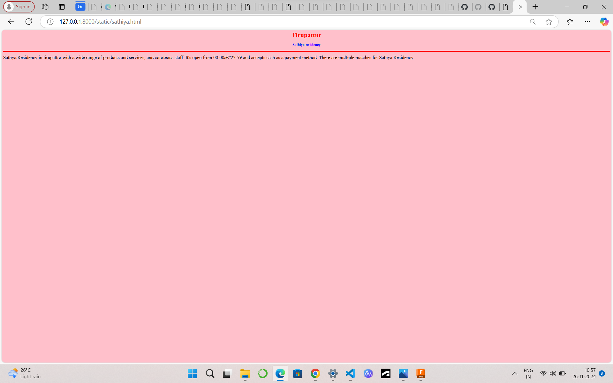
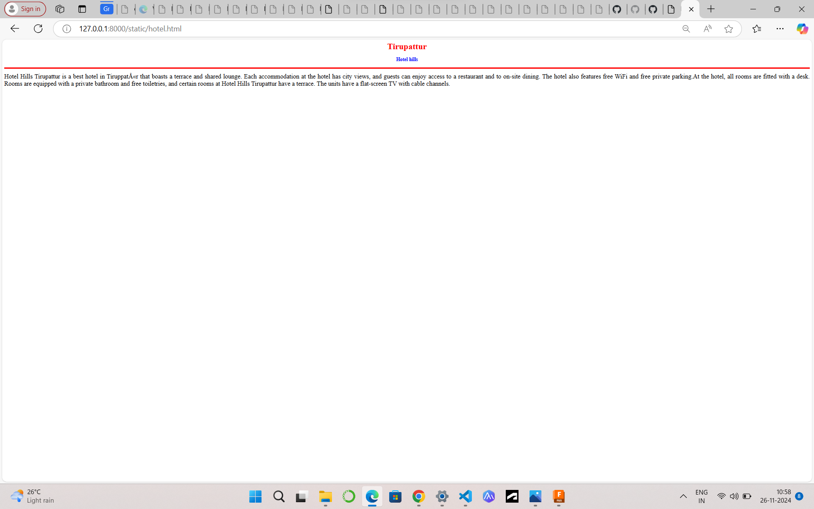
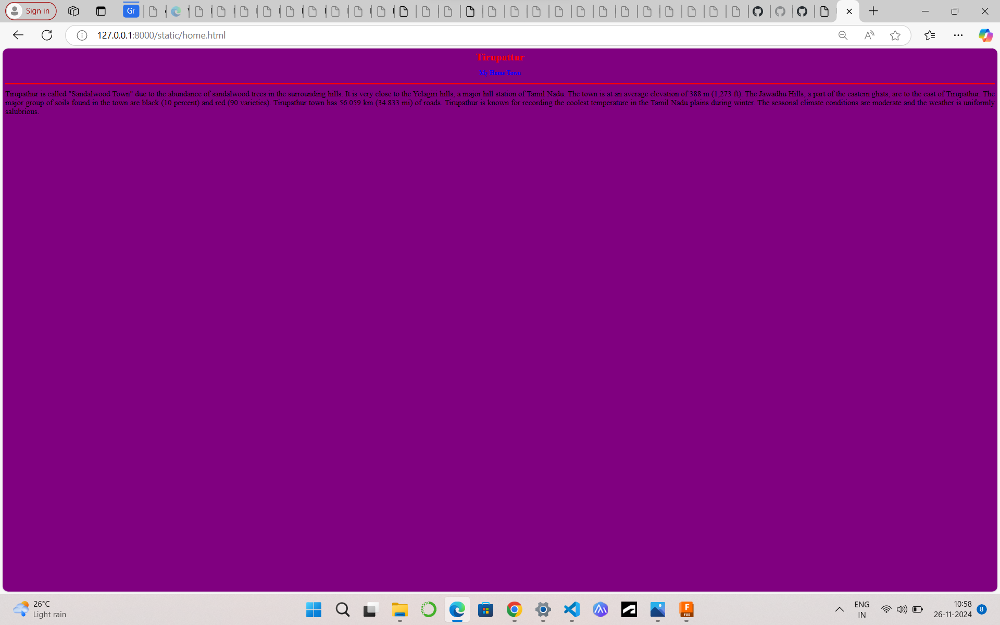

# Ex04 Places Around Me
## Date: 25.11.2024

## AIM
To develop a website to display details about the places around my house.

## DESIGN STEPS

### STEP 1
Create a Django admin interface.

### STEP 2
Download your city map from Google.

### STEP 3
Using ```<map>``` tag name the map.

### STEP 4
Create clickable regions in the image using ```<area>``` tag.

### STEP 5
Write HTML programs for all the regions identified.

### STEP 6
Execute the programs and publish them.

## CODE
```
map.html

html>
   < <head>
        <title>My City</title>
    </head>
    <body>
        <h1 align="center">
        <font color="red"><b>Tirupattur</b></font>
        </h1>
        <h3 align="center">
            <font color="blue"><b>keerthika A (24900898)</b></font>
        </h3>
        <center>
            
            <map name="MyCity">
    <area target="" alt="Sathiya residency" title="Sathiya residency" href="sathiya.html" coords="862,383,1060,464" shape="rect">
    <area target="" alt="Hotel hills" title="Hotel hills" href="hotel.html" coords="905,627,1157,688" shape="rect">
    <area target="" alt="Green trends" title="Green trends" href="trends.html" coords="1010,311,1179,353" shape="rect">
    <area target="" alt="Jalagamparai falls" title="Jalagamparai falls" href="falls.html" coords="1620,653,1498,570" shape="rect">
    <area target="" alt="My Home Town" title="My Home Town" href="home.html" coords="947,524,1071,565" shape="rect">
            </map>
        </center>
    </body>
</html>

falls.html

<html>
    <head>
        <title>My Home Town</title>
    </head>
    <body bgcolor="gold">
    <h1 align="center">
        <font color="red"><b>Tirupattur</b></font>
    </h1>
    <h3 align="center">
        <font color="blue"><b>Jalagamparai falls</b></font>
    </h3>
    <hr size="3" color="red">
    <p align="justify">
        <font face="Tirupattur"size="5">
            The best time to visit Jalagamparai Waterfalls is during the monsoon season when the hills are alive with the vitality of rejuvenated life, 
            the cascading streams and waterfalls dance with joy, and the weather is cool and pleasant. It's a time of mystical enchantment, 
            a season of renewal that inspires the heart and the soul.
            In addition to the resplendent waterfall, Jalagamparai also boasts several nearby attractions that visitors can explore.
            The Swamimalai Hills and Yelagiri Hills present a chance to soar to new heights, and the Jalakandeswarar Temple beckons with ancient lore and a palpable sense of spirituality.
             Visitors can also enjoy camping in the nearby forests or embark on a trek to discover hidden trails and the secrets of the lush forest enveloping the waterfall.

        </font>
    </p>
</body>
</html>

home.html

<html>
    <head>
        <title>My Home Town</title>
    </head>
    <body bgcolor="purple">
    <h1 align="center">
        <font color="red"><b>Tirupattur</b></font>
    </h1>
    <h3 align="center">
        <font color="blue"><b>My Home Town</b></font>
    </h3>
    <hr size="3" color="red">
    <p align="justify">
        <font face="Tirupattur"size="5">
             Tirupathur is called "Sandalwood Town" due to the abundance of sandalwood trees in the surrounding hills.
             It is very close to the Yelagiri hills, a major hill station of Tamil Nadu.
             The town is at an average elevation of 388 m (1,273 ft). The Jawadhu Hills, a part of the eastern ghats, are to the east of Tirupathur. 
             The major group of soils found in the town are black (10 percent) and red (90 varieties). Tirupathur town has 56.059 km (34.833 mi) of roads.
             Tirupathur is known for recording the coolest temperature in the Tamil Nadu plains during winter.
             The seasonal climate conditions are moderate and the weather is uniformly salubrious.

        </font>
    </p>
</body>
</html>

hotel.html

<html>
    <head>
        <title>My Home Town</title>
    </head>
    <body bgcolor="white">
    <h1 align="center">
        <font color="red"><b>Tirupattur</b></font>
    </h1>
    <h3 align="center">
        <font color="blue"><b>Hotel hills</b></font>
    </h3>
    <hr size="3" color="red">
    <p align="justify">
        <font face="Tirupattur"size="5">
            Hotel Hills Tirupattur is a best hotel in Tiruppatūr that boasts a terrace and shared lounge.
            Each accommodation at the hotel has city views, and guests can enjoy access to a restaurant and to on-site dining.
            The hotel also features free WiFi and free private parking.At the hotel, all rooms are fitted with a desk. 
            Rooms are equipped with a private bathroom and free toiletries, and certain rooms at Hotel Hills Tirupattur have a terrace.
            The units have a flat-screen TV with cable channels.
        </font>
    </p>
</body>
</html>

sathiya.html

<html>
    <head>
        <title>My Home Town</title>
    </head>
    <body bgcolor="pink">
    <h1 align="center">
        <font color="red"><b>Tirupattur</b></font>
    </h1>
    <h3 align="center">
        <font color="blue"><b>Sathiya residency</b></font>
    </h3>
    <hr size="3" color="red">
    <p align="justify">
        <font face="Tirupattur"size="5">
             Sathya Residency in tirupattur with a wide range of products and services, and courteous staff.
             It's open from 00:00–23:59 and accepts cash as a payment method.
             There are multiple matches for Sathya Residency
            
        </font>
    </p>
</body>
</html>

trends.html

<html>
    <head>
        <title>My Home Town</title>
    </head>
    <body bgcolor="yellow">
    <h1 align="center">
        <font color="red"><b>Tirupattur</b></font>
    </h1>
    <h3 align="center">
        <font color="blue"><b>Green trends</b></font>
    </h3>
    <hr size="3" color="red">
    <p align="justify">
        <font face="Tirupattur"size="5">
             Green Trends is known for being one of the best salons for men's haircuts and styling.
             They offer a variety of haircuts, including low fade, man bun, faux hawk, crew cut, quiff, pompadour,
             French crop, comb over, and ivy league
        </font>
    </p>
</body>
</html>
```
## OUTPUT
-1.png>)   





## RESULT
The program for implementing image maps using HTML is executed successfully.
